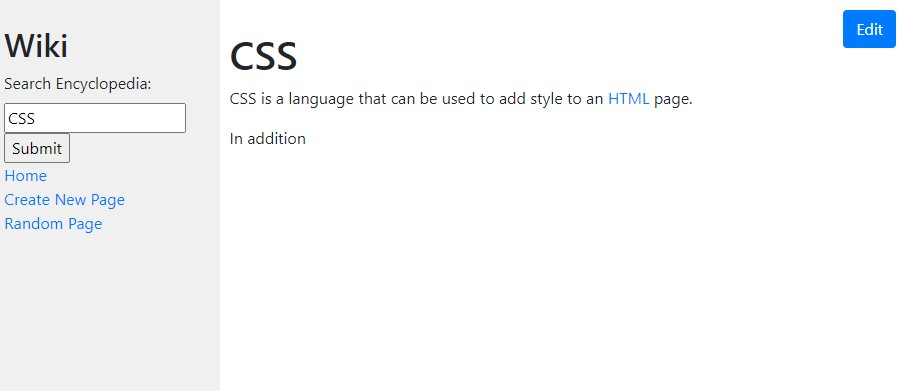

# 📚 Wiki 📚
This project is a wikipedia-like online encyclopedia. It is an open source platform where users can view, edit, and create new pages for the online wiki for everyone to see. The application was built using <a href="https://www.djangoproject.com/">Django</a>, and developed as a part of CS_50's Web Programming with Python and Javascript course.

---
## Main Page
The main page of the application can be seen below, where an entire list of all the pages can be found. Each item of the list provides a direct link to it's corresponding page, providing easy access to users for navigation.

Every page within the program also provides the side bar as seen above. It provides easy access links, as well as a search bar that one can search any page on.

---
## Search
A user can search anything within the search bar, and if the input string matches a page title (regardless of capitilization) then the user is sent directly to the page. Otherwise an error message is shown to the user, as well as related pages that the user might have meant...

---
## Pages
In practise, writing a page in HTML would require a lot of work, which is why this application allows users to write the pages using Markdown. By having each encyclopedia entry represented using Markdown, it makes writing and editting pages human-friendly.

In the backend, the markdown is converted into HTML to be displayed online.

Creating and editting new page is very simple and user-friendly...

